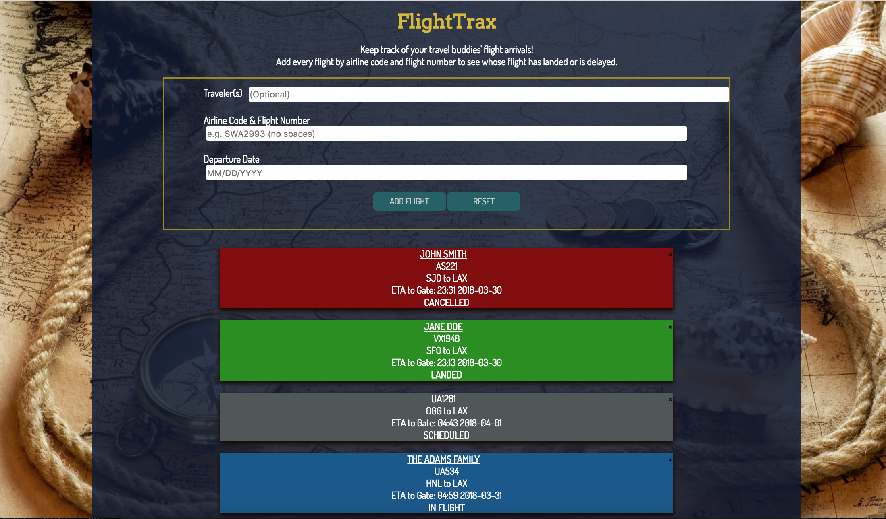

# FlightTrax

**Table of Contents**

1. Introduction(#introduction)
2. How to Use(#how-to-use)
3. Technologies Used(#technologies-used)
4. Future Implementations(#future-implementations)

**Live Demo:** [FlightTrax](https://staysee.github.io/flight_trax)

## Introduction
Traveling with a group of friends or family on different flights? FlightTrax will allow you to keep track of all flights in one spot!

You can see whose flight has landed, is delayed (and delayed arrival time), in-flight, or the worst - cancelled, redirected, or diverted.
Each flight can be labeled with the traveler name(s) and also color-coded to indicate different statuses.

## How to Use

Enter the following information and click the Add Flight button:

* **Traveler Name(s):** *Optional to label the flight*
* ***Airline Code+Flight Number:** *Airline code and flight number must be entered with no spaces. Format must be letters for airline code and numbers for flight numbers.* 
* ***Departure Date:** *Select flight's departure date from departure city*
* ***Select Arrival City**: *If a flight number has multiple legs, you will be prompted to select your arrival destination. To track multiple legs of the flight, please enter the flight again for each city needed.*

\*Required fields

To remove a flight, click the "x" to delete it from the list.
To clear all flights, click the Reset button.

## Technologies Used
FlightTrax is built with a FlightStats API, HTML, CSS, JavaScript, jQuery, jQuery UI, GoogleFonts

## Future Implementations
* Shareable link - flights can be entered once and a link can be created to share with the other travelers in the group
* More information regarding the flights
